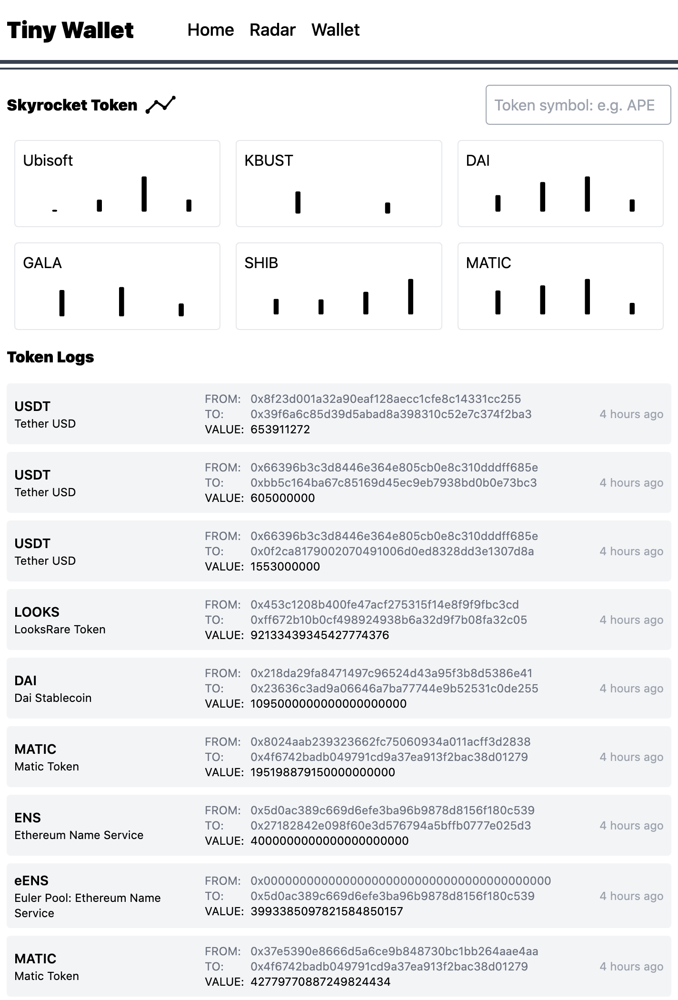

[TinyWallet](https://tinywallet.app)

## Features

TinyWallet is a cloud base wallet.

. token radar - find recently tranfers grow up fast token
. crosschain wallet
. api support, not only a wallet, you can build a puppet controller your wallet

> This project was developed for [Multi-Chain Web3 Projects](https://gitcoin.co/issue/covalenthq/covalent-gitcoin-bounties/19/100028550) bounty at the [Grants Round 13 Hackathon](https://gitcoin.co/hackathon/gr13/?) sponsored by [Covalent](https://www.covalenthq.com).

### Covalent API Details
[Get a transaction](https://www.covalenthq.com/docs/api/#/0/Get%20a%20transaction/USD/1) `` Get a transation with decoded event logs `` - thanks to this power api, we can analytic the token transfer in a transation. super easy to find the most potensial token.

## Independent deploy

1. `cp .env.default .env`
2. `vi .env`
3. `npm install`
4. `pm2 start`

so easy, no magic
